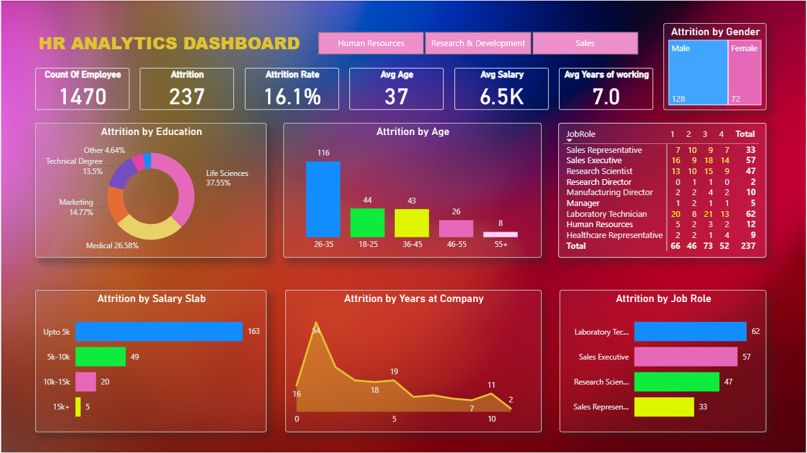

# 📊 HR Analytics Dashboard — Power BI

---

## 📌 Project Overview

This is an **interactive HR Analytics Dashboard** built in Power BI. The primary focus of this project is to visualize **employee attrition** within a company and uncover meaningful patterns behind it. HR teams can use this dashboard to make informed decisions — such as identifying which departments have higher attrition, which age groups or job roles are most affected, and more.

---

## 🎯 Objectives

- Track the company's overall **attrition rate**
- Identify **department-wise, age-wise, and gender-wise** attrition patterns
- **Visually highlight** high-risk employee segments
- Help HR teams make **data-driven decisions**

---

## 📈 Dashboard Features & Visualizations

### 🔹 KPI Cards
- Total Employees
- Total Attrition Count
- Attrition Rate (%)
- Average Age
- Average Salary
- Average Years at Company

### 🔹 Charts & Visuals
- **Attrition by Department** — Bar Chart
- **Attrition by Age Group** — Column Chart
- **Attrition by Gender** — Donut Chart
- **Attrition by Job Role** — Horizontal Bar Chart
- **Attrition by Salary Slab** — Bar Chart
- **Attrition by Years at Company** — Line Area Chart
- **Attrition by Education Field** — Bar Chart
- **Job Satisfaction Matrix** — Matrix Visual

### 🔹 Filters / Slicers
- Department
- Gender
- Age Group
- Education Field

---

## 🗃️ Dataset Description

The dataset contains employee-level information with the following key columns:

| Column | Description |
|--------|-------------|
| `EmployeeID` | Unique employee identifier |
| `Age` | Age of the employee |
| `Gender` | Male / Female |
| `Department` | HR, Sales, R&D, etc. |
| `JobRole` | Job title / role |
| `EducationField` | Field of education |
| `MonthlyIncome` | Monthly salary |
| `YearsAtCompany` | Total years worked at the company |
| `Attrition` | Yes / No (target variable) |
| `JobSatisfaction` | Rating from 1 to 4 |

---

## 🛠️ Tools & Technologies

- **Power BI Desktop** — Dashboard development
- **Microsoft Excel / CSV** — Data source
- **DAX (Data Analysis Expressions)** — Custom measures & KPIs
- **Power Query** — Data cleaning & transformation

 🚀 How to Use

- **Clone or download this repository**
- **Open .pbit in Power BI Desktop**
- **When prompted, select the CSV file path**
- **Explore the dashboard — use the slicers to filter and analyze different views**

---

## 📊 Key Insights

- 📉 Overall attrition rate is approximately **16%**
- 🔴 The **Sales** department shows the highest attrition
- 👶 The **26–35 age group** has the highest attrition count
- 💰 Employees in the **low salary slab** (up to 5k) are most likely to leave
- ⏱️ Employees with **0–2 years** of tenure are at the highest risk of attrition

---

## 📊 Dashboard Preview

---

> ⭐ If you found this project helpful, don't forget to give it a **Star**!
